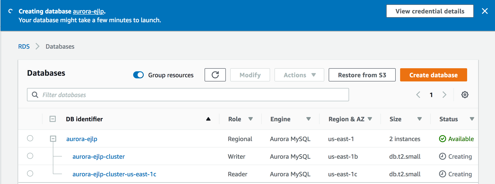
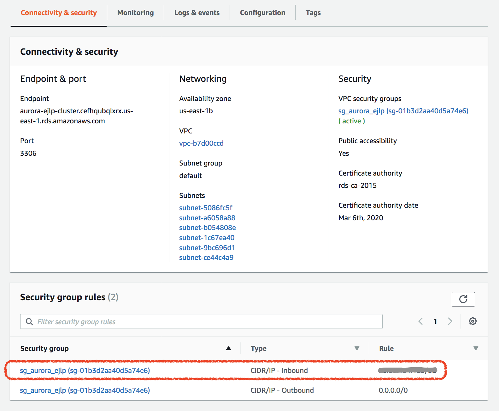
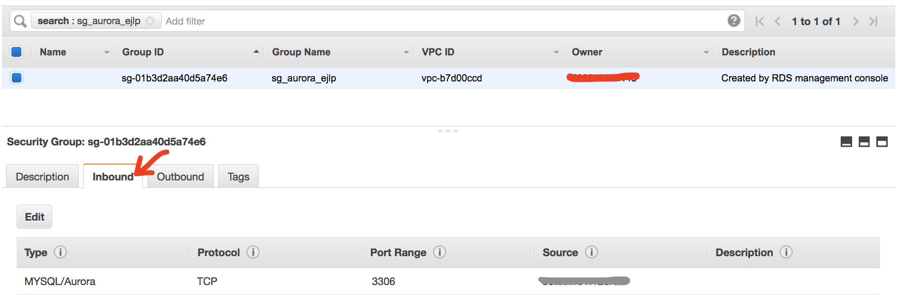
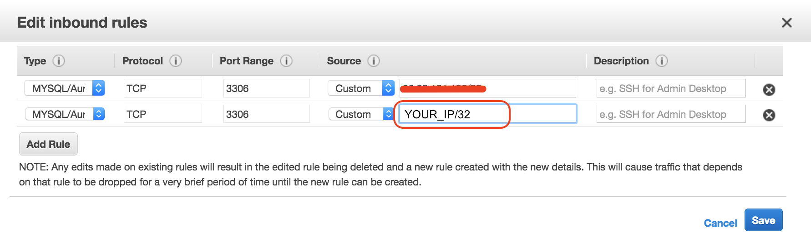

# Creating an Amazon Aurora Database Cluster

An Amazon Aurora DB cluster consists of a DB instance, compatible with either MySQL or PostgreSQL, and a cluster volume that represents the data for the DB cluster, copied across three Availability Zones as a single, virtual volume. The DB cluster contains a primary instance and, optionally, up to 15 Aurora Replicas.

In this section, we will create a simple Aurora DB cluster with a primary node and a standby node.

??? Tips "Watch video demo"
    [Building Your Application with an Amazon Aurora Database](https://youtu.be/-ychuATbqPY?t=292)

## Create an Aurora DB cluster (Console)

!!! Warning
    The Console user interface can be different, if you found message on the top "Switch to the new database creation flow." then click it. This steps below is based on the new UI design. 

1. In the AWS Management Console, on the **Services** menu, click [RDS](https://console.aws.amazon.com/rds/).
2. In the top-right bar, select the AWS **Region** in which you want to create the Aurora DB cluster. 
3. In the **Dashboard** page, click **Create database**.
4. In the **Engine options** section, select **Amazon Aurora**.
5. On the **Edition**, choose **Amazon Aurora with MySQL compatibility**, then select latest version **Aurora (MySQL)-5.6.10a**
6. For **Database Location** ,select **Regional** 
7. For **Database Features**, select **One writer and multiple readers**
8. For **Templates**, select **Production**.
9. On the **Settings**, specify DB details
    - **DB cluster identifier**: ==`aurora_{YOUR_NAME}`== (for example: `aurora-ejlp`)
    - **Master username**: `admin`
    - **Master Password**: `Password123!` and type the same value in the **Confirm Password**
10. For **DB instance class**, choose **Burstable classes (includes t classes)** and select **db.t2.small** as the type of your EC2 instance
11. On the **Availability & durability**, select **Create an Aurora Replica/Reader node in a different AZ (recommended for scaled availability)**
    
    !!! Info 
        Selecting this option will makes Amazon RDS maintain a synchronous standby replica in a different Availability Zone than the DB instance. Amazon RDS will automatically fail over to the standby in the case of a planned or unplanned outage of the primary.
 
12. On the **Connectivity**, configure as following
    - **VPC**: Use default
    - **Subnet group**: Use default
    - **Public accessibility**: Yes (:warning: should be ok for this lab only)
    - **VPC security groups**: Create new VPC Security group, ==`sg_aurora_{YOUR_NAME}`==
    - **Database Port**: Use default (3306)
13. Click **Additional Configuration**, Database options
    - **DB cluster identified**: ==`aurora-{YOUR_NAME}-cluster`==
    - **Database name**: ==`{YOUR_NAM}]_database`==
    - **DB parameter group**: **default.aurora5.6**
    - **DB cluster parameter group**: **default.aurora5.6**
    - **Failover Priority**: **No preference**
    - Uncheck **Enable Encryption**
    - Uncheck **Enable deletion protection**

    Examine all the fields, and	leave the remanding sections to their default values and go to the bottom of the page. 

14. Click **Create database**
    
    > Note: After clicking Create database the creating process will take some time to complete.

    

17.	When your database instance status changes to Available.  Select  ==`aurora-{yourname}`== from the **DB indentifier** column
18.	Scroll down to **Connectivity & Security** section and note down your **Endpoints** (both the Reader and Writer endpoint).  These endpoints are needed in later sections of the lab.
 
    !!! Note
        By default, Aurora Reader endpoint will use master DB instance when you create Aurora cluster without any read replica DB instance.   When you add read replicas later, the reader endpoint will automatically use read replica for all read only queries.    


Up to this point, you have created a new Aurora MYSQL cluster with a primary and standby node.  The standby node `aurora-{yourname}-{region-az}` is the standby node that is used if the primary database goes down.  In the next section, we will access the primary Aurora node.


## Accessing your cluster

In this lab, we will be running SQL commands in the local computer.  In order to access the Aurora cluster, you will need to open up proper **security groups** to enable connection between your local computer and the Aurora node.  

To Enable traffic, perform the following:

1. Select Witer (primary) database ==`aurora-{yourname}`==
2. On the **Connectivity & security** tab, select the security group that has Type: **CIDR/IP - Inbound**
   
   

3. Click on the **Inbound** tab
    

5.	Click on **Edit**

6.	Modify the existing inbound rule 
    - Type: `MYSQL/Aurora` 
    - For **Source** fill in with your IP address of your machine and specify the address using the `/32` prefix length.
    
    

    !!! Tips "Knowing your IP address"
        You can use a browser to know your IP address by accessing http://ifconfig.co or use command `curl ifconfig.co`
 
7.	Click **Save**

8.	Verify you can access the  mysql client from your computer using following command:
    ``` shell
    mysql -h aurora-{yourname}-cluster.{xxxxxxx}.{REGION}.rds.amazonaws.com -u root -p 
    Enter password: 
    mysql> 
    ```

    

    ??? Note "Install MySQL Client"
        If your system does not recognize the `mysql` command, please install MySQL on your machine.
        On Mac, the easiest way is using `brew install mysql-client` or [install MySQLWorkbench](https://dev.mysql.com/downloads/workbench/) and then set your PATH:

        ```
        export PATH=$PATH:/Applications/MySQLWorkbench.app/Contents/MacOS
        ```

        On some Linux distribution or your **Cloud9 IDE**, you use this command:
        ```
        yum install mysql
        ```

9.	Exit from the primary cluster.

    To exit from the `mysql>` prompt, use <kbd>CTRL</kbd>-<kbd>D</kbd> or type `exit`


