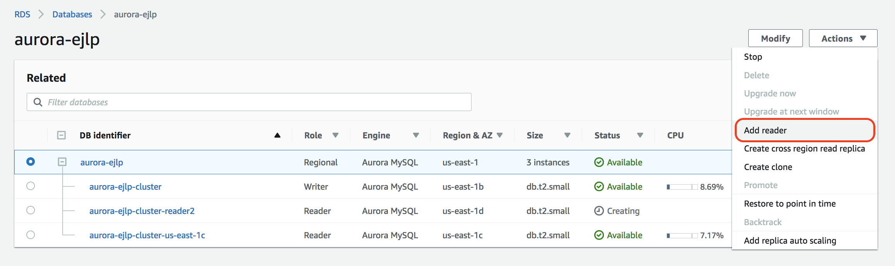

## Create New Read Replica

Aurora Replicas are independent endpoints in an Aurora DB cluster, best used for scaling read operations and increasing availability. The DB cluster volume is made up of multiple copies of the data for the DB cluster. However, the data in the cluster volume is represented as a single, logical volume to the primary instance and to Aurora Replicas in the DB cluster.

All Aurora Replicas return the same data for query results with minimal replica lag.

Aurora Replicas work well for read scaling because they are fully dedicated to read operations on your cluster volume. Write operations are managed by the primary instance. Because the cluster volume is shared among all DB instances in your DB cluster, minimal additional work is required to replicate a copy of the data for each Aurora Replica.

To Create a new Read replica perform the following tasks:

1. Go to the [RDS Aurora Console](https://console.aws.amazon.com/rds/home)
2. In the top-right corner of the AWS Console, select the AWS **Region** (i.e. N. Virginia)
3. Click on **Databases** 
4. Select or click your DB instance name `aurora-{YOUR_NAME}`
5. Click **Actions** button
6. For Actions, choose **Add reader**.
   
    The Add reader page appears.

    

7.	Enter the following values for your replica
    - **DB instance identifier**: ==`aurora-{YOUR_NAME}-cluster-reader2`==
    - **Availability Zone**: No preference
    - **Publicly accessible**: Yes 
      > :warning: should be ok for this lab only!
    - **Encryption**: Disable encryption
    - **Instance Specification**: choose **db.t2.small** for instance class
    - Under Settings, **Aurora replica source**: select `aurora-{YOUR_NAME}(DB Cluster:{YOUR_NAME}-cluster)`
    - **Failover** – No preference

     Leave all other fields as their default values

8.	Click **Add reader**

    !!! Info ""
        It may take a few minutes for the read replica to become available.  Wait until the read replica is available.

## Reading Data from Aurora Read Replica

1.	Once the read replica becomes available, click on the instance `aurora-{YOUR_NAME}-cluster-reader2`
2.	Go to the **Connect** details, and copy the read replica **Endpoint**. 

    It should be something like: ``aurora-{YOUR_NAME}-cluster-reader2.xxxxxxxxxxxxxxx.us-east-1.rds.amazonaws.com`

3.	Connect read replica from your computer.  Make sure to replace the value below with your read replica endpoint
    ``` shell
    mysql -h <READ_REPLICA_ENDPOINT> –u <username> -p
    ```
    Example:
    ``` shell
    mysql -h aurora-<YOURNAME>-read-replica.xxxxxxxxxxxx.<REGION>.rds.amazonaws.com -u root -p
    ```
4.	Use the read replica endpoint to run following SELECT query; 
    - `mysql> use landsat;`
    - `mysql> select count(*) from scene_list;`
        Result should look similar to the following
        ```
        +----------+
        | count(*) |
        +----------+
        |       10 |
        +----------+
        1 row in set (0.09 sec)
        ```
    
    Note: The read replica and primary database have the same records

5.	Exit from the read replica database
    ```
    mysql> exit;
    ```