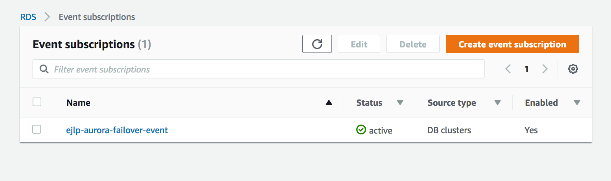
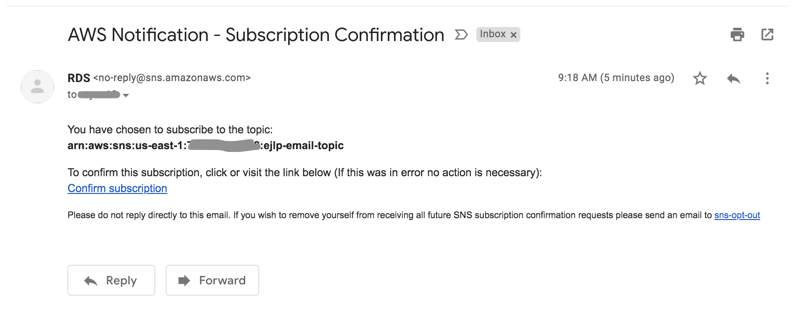

Amazon RDS uses the Amazon Simple Notification Service (Amazon SNS) to provide notification when an Amazon RDS event occurs. These notifications can be in any notification form supported by Amazon SNS for an AWS region, such as an email, a text message, or a call to an HTTP endpoint.
To subscribe to RDS event notification

1. Sign in to the AWS Management Console, click **Services** and select **[RDS](https://console.aws.amazon.com/rds/)**.
2. In navigation pane, choose **Event Subscriptions**. 
3. In the **Event subscriptions** pane, choose **Create event subscription**. 
4. In the **Create event subscription** dialog box, do the following:
   - Type `{yourname}-aurora-failover-event` for the **Name** of subscription
   - For Send notifications to, choose **New email topic**
   - Topic Name: `{yourname}-email-topic`
   - For with these recipients, type `{your email address}`.  Make sure you can have access to your desired email address.
   - For the **Source** type, select DB Clusters
   - Select **Specific db clusters**
   - Choose `aurora-{yourname}`
   - On the **Event category to include**, choose **Select specific event categories**
   - On **Specific event**, choose **failover**
      Note: Ensure you have picked “Failover” and not “Failure” for event
5. Click **Create**.
 
    

6. Check you email inbox folder, you will find a subscription confirmation email as following. Click on **Confirm subscription** link
   
   
   
7. Once the subscription is active, go to your email inbox and confirm the event subscription. You have now created an event subscription that will get triggered when you failover your aurora cluster.
