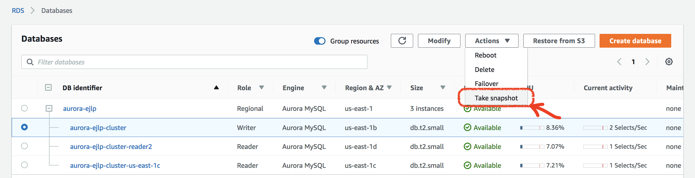
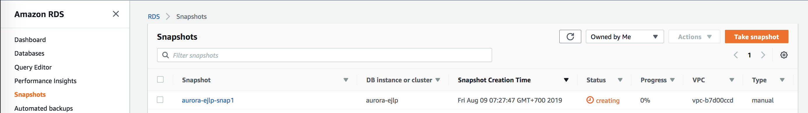
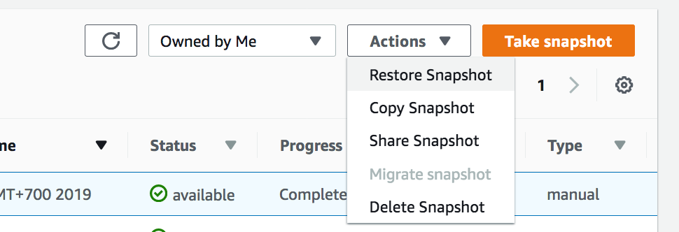
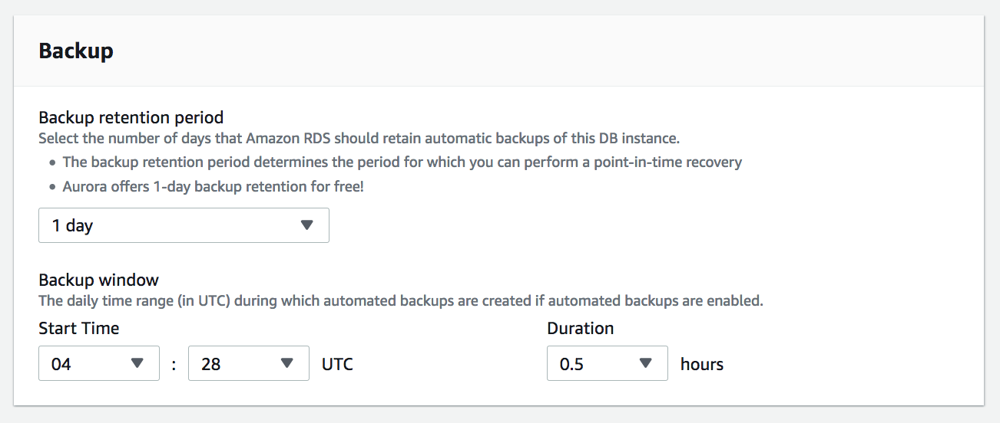
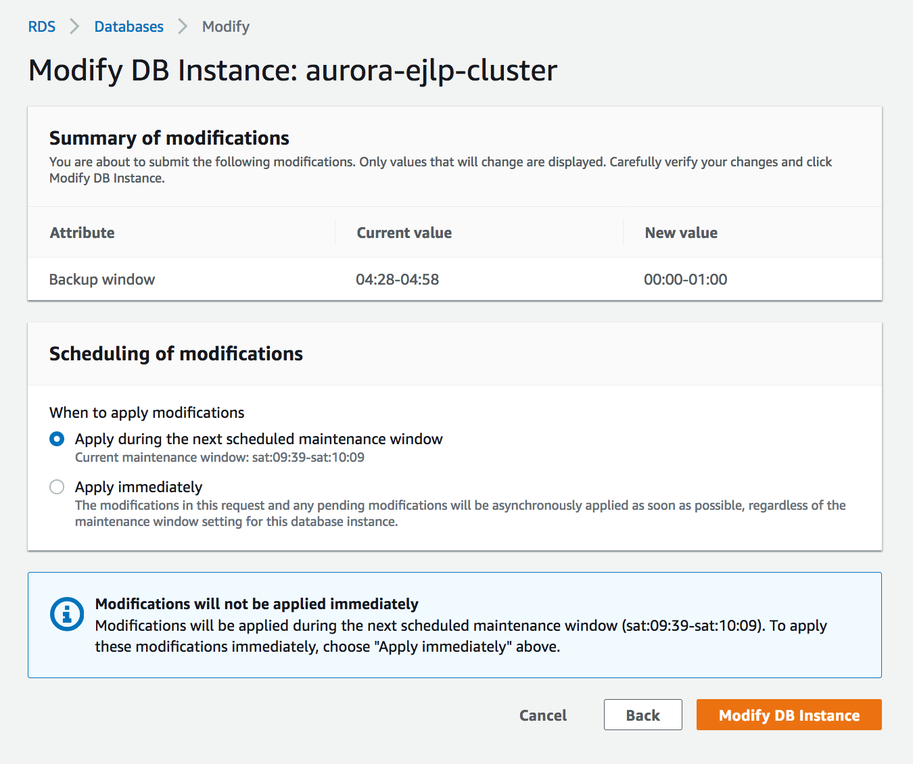

## Manually Create Snapshot

Amazon RDS creates a storage volume snapshot of your DB cluster, backing up the entire DB cluster and not just individual databases. When you create a DB cluster snapshot, you need to identify which DB cluster you are going to back up, and then give your DB cluster snapshot a name so you can restore from it later. The amount of time it takes to create a DB cluster snapshot varies with the size your databases. Since the snapshot includes the entire storage volume, the size of files, such as temporary files, also affects the amount of time it takes to create the snapshot

To create a DB cluster snapshot manually:

1. Open the Amazon RDS console at https://console.aws.amazon.com/rds/.
2. In the navigation pane, choose **Databases**.
3. In the list of DB instances, choose the primary instance for the DB cluster `aurora-{yourname}-cluster`.
4. Choose instance **Actions**, and then choose **Take snapshot**.
   
    

    The Take DB Snapshot window appears.

5. Type the name of the DB cluster snapshot `aurora-{YOUR_NAME}-snap1` in the **Snapshot name** box. 
6. Click **Take Snapshot** button.

    **Snapshots** page will appear showing list of all snapshots.

    

7.  Once the status of your snapshot becomes available, select `aurora-{YOUR_NAME}-snap1` then click **Actions**
8.  Choose the drop down to see all the options available.  
    
    

## Automatic Backup

When we create a database, if your notice there is a configuration for backup. Now we will update the automated backup setting.

1. Open the Amazon RDS console at https://console.aws.amazon.com/rds/.
2. In the navigation pane, choose **Databases**.
3. In the list of DB instances, choose the primary instance for the DB cluster `aurora-{yourname}-cluster`.
4. Click **Modify** button
5. Go to **Backup** section
   
   

6. Change the **Start time** and the **Duration**
7. Click **Continue**
8. In the confirmation page, select **Apply immediately**
9. Click **Modify DB Instance**

    

!!! Note "Recap"
    - Snapshot is stored in S3
    - You can restore, copy, share or delete a snapshot. You can copy a snapshot between regions, and you can share a snapshot across accounts. 
    - 
    - More info about [Aurora Backup](https://docs.aws.amazon.com/AmazonRDS/latest/AuroraUserGuide/aurora-storage-backup.html)
